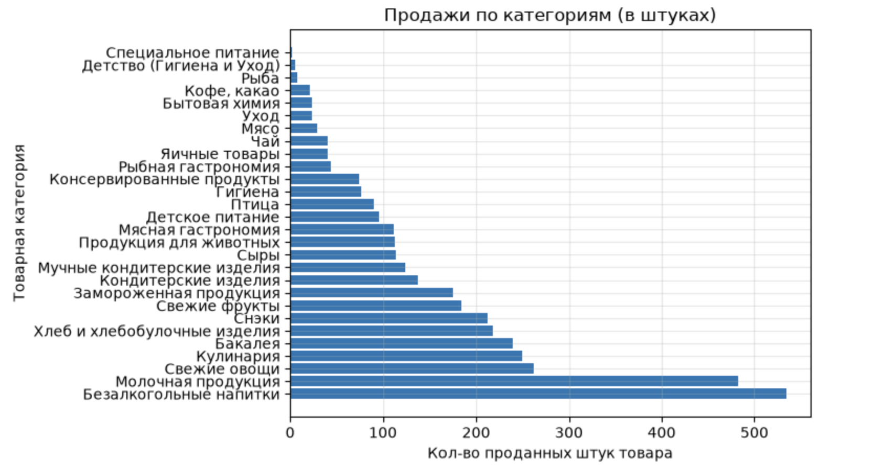
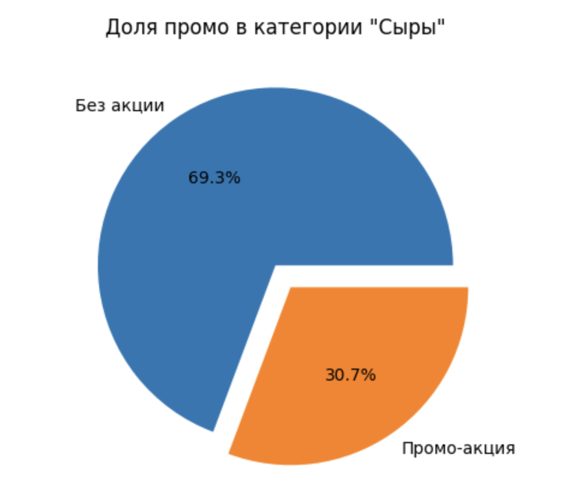
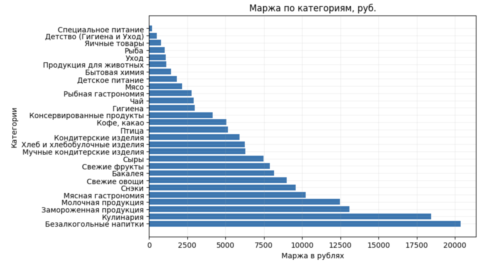

# Анализ розничных продаж продуктового ритейла
Анализ данных о продажах продуктового магазина: оценка товарных категорий, маржинальности, промо-эффективности и ABC-анализ ассортимента. Проект выполнен в формате Jupyter Notebook и содержит визуализации, таблицы и текстовые выводы по каждому этапу анализа.

## Используемые технологии

- **Python 3.8+**
- **Pandas** — обработка и агрегация данных
- **NumPy** — математические вычисления
- **Matplotlib / Seaborn** — визуализация данных
- **Jupyter Notebook** — интерактивная среда выполнения

## Примеры визуализаций

### Самые продаваемые категории



### Соотношение промо- и регулярных продаж



### Маржинальность по категориям




## Установка
```bash
# 1. Клонируйте репозиторий
git clone https://github.com/sofyaming/retail-sales-analysis.git
cd retail-sales-analysis

# 2. Создайте виртуальное окружение
python -m venv venv
# для Mac/Linux
source venv/bin/activate
# для Windows
venv\Scripts\activate

# 3. Установите зависимости
pip install -r requirements.txt

# 4. Запустите Jupyter Notebook
jupyter notebook
